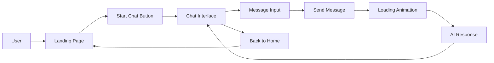

# ✦ SimpleTextBot

```
███████╗██╗███╗   ███╗██████╗ ██╗     ███████╗████████╗███████╗██╗  ██╗████████╗██████╗  ██████╗ ████████╗
██╔════╝██║████╗ ████║██╔══██╗██║     ██╔════╝╚══██╔══╝██╔════╝╚██╗██╔╝╚══██╔══╝██╔══██╗██╔═══██╗╚══██╔══╝
███████╗██║██╔████╔██║██████╔╝██║     █████╗     ██║   █████╗   ╚███╔╝    ██║   ██████╔╝██║   ██║   ██║   
╚════██║██║██║╚██╔╝██║██╔═══╝ ██║     ██╔══╝     ██║   ██╔══╝   ██╔██╗    ██║   ██╔══██╗██║   ██║   ██║   
███████║██║██║ ╚═╝ ██║██║     ███████╗███████╗   ██║   ███████╗██╔╝ ██╗   ██║   ██████╔╝╚██████╔╝   ██║   
╚══════╝╚═╝╚═╝     ╚═╝╚═╝     ╚══════╝╚══════╝   ╚═╝   ╚══════╝╚═╝  ╚═╝   ╚═╝   ╚═════╝  ╚═════╝    ╚═╝   
```

### A minimal, modern AI chat experience with stunning design ✦


---

## 🌟 Overview

**SimpleTextBot** is a beautifully crafted AI chat interface that combines minimal design with powerful functionality. Built with modern web technologies, it offers a seamless chat experience with smooth animations, gradient aesthetics, and an intuitive interface.

### ✨ Key Highlights

- 🎨 **Stunning Dark Landing Page** - Gradient animations, glowing effects, and live chat preview
- 💬 **Clean Chat Interface** - Light theme with card-based messages and sidebar navigation
- ⚡ **Real-time Responses** - Animated loading indicators with gradient bouncing dots
- 🎭 **Dual Mode Design** - Separate landing and chat components for optimal UX
- 🚀 **Modern Tech Stack** - Built with React, Next.js, and Tailwind CSS
- ✦ **Unique Branding** - Asterisk-themed micro-identity throughout the app

---

## 📸 Preview


### Landing Page
- Dark theme with animated background orbs
- Live conversation animation preview
- Gradient text effects and smooth transitions

### Chat Interface
- Light, clean design with card-style messages
- Sidebar with logo and navigation
- Centered input that flows down after first message
- Gradient loading animations

---

## 🏗️ Architecture



### System Architecture (ASCII)

```
+------------------+     +----------------------+     +----------------+
|  Landing Page    | --> |   Chat Interface     | --> |  AI Response   |
|  (Dark Theme)    |     |   (Light Theme)      |     |  Generation    |
+------------------+     +----------------------+     +----------------+
         |                         |                          |
         v                         v                          v
+------------------+     +----------------------+     +----------------+
| Animated Orbs    |     | Message Cards        |     | Gradient Dots  |
| Live Chat Demo   |     | Sidebar Navigation   |     | Smooth Fade-in |
+------------------+     +----------------------+     +----------------+
```

---

## 🚀 Features

### Landing Page
- ✅ Dark theme with animated background
- ✅ Live conversation preview animation
- ✅ Gradient text effects on headline
- ✅ Feature cards with hover effects
- ✅ Multiple CTA buttons
- ✅ Responsive design
- ✅ Smooth scroll animations

### Chat Interface
- ✅ Light, clean design
- ✅ Sidebar with logo and branding
- ✅ Card-style message bubbles
- ✅ Gradient avatar icons
- ✅ Animated loading indicators
- ✅ Centered empty state
- ✅ Auto-scroll to latest message
- ✅ Textarea with Enter/Shift+Enter support
- ✅ Back to home navigation

### Animations
- ✅ Fade-in message animations
- ✅ Slide-in effects
- ✅ Gradient bouncing dots loader
- ✅ Hover scale transitions
- ✅ Smooth color transitions

---

## 📁 Project Structure

```
simpletextbot/
│
├── components/
│   ├── LandingPage.tsx        # Dark landing page component
│   ├── ChatPage.tsx            # Light chat interface component
│   └── index.tsx               # Main app component with routing
│
├── assets/
│   ├── demo.gif                # Demo animation
│   ├── banner.png              # Repository banner
│   └── screenshots/            # UI screenshots
│
├── styles/
│   └── globals.css             # Global styles and animations
│
├── public/
│   └── favicon.ico             # App icon
│
├── package.json
├── tsconfig.json
├── next.config.js
├── tailwind.config.js
└── README.md
```

---

## 🛠️ Tech Stack

- **Framework**: [Next.js 15](https://nextjs.org/)
- **UI Library**: [React 18](https://react.dev/)
- **Styling**: [Tailwind CSS](https://tailwindcss.com/)
- **Icons**: [Lucide React](https://lucide.dev/)
- **Language**: TypeScript
- **Animations**: CSS Keyframes + Tailwind

---

## 📦 Installation

### Prerequisites
- Node.js 18+ installed
- npm or yarn package manager

### Clone Repository

```bash
git clone https://github.com/USERNAME/simpletextbot.git
cd simpletextbot
```

### Install Dependencies

```bash
npm install
# or
yarn install
```

### Run Development Server

```bash
npm run dev
# or
yarn dev
```

Open [http://localhost:3000](http://localhost:3000) in your browser.

### Build for Production

```bash
npm run build
npm start
# or
yarn build
yarn start
```

---

## 🎨 Design System

### Color Palette

**Landing Page (Dark Theme)**
- Background: `#000000` (Black)
- Text: `#FFFFFF` (White)
- Accent 1: `#8B5CF6` (Purple)
- Accent 2: `#3B82F6` (Blue)
- Accent 3: `#EC4899` (Pink)

**Chat Interface (Light Theme)**
- Background: `#F5F5F5` (Light Gray)
- Cards: `#FFFFFF` (White)
- Text: `#111827` (Gray-900)
- AI Avatar: Gradient (Blue → Purple)
- User Avatar: `#111827` (Gray-900)

### Typography
- Font Family: System UI, sans-serif
- Weights: Light (300), Regular (400), Medium (500)
- Sizes: 12px - 96px (responsive)

### Spacing
- Base unit: 4px
- Card padding: 24px
- Section spacing: 80px
- Message gap: 24px

---

## 🎯 Usage

### Basic Setup

```tsx
import SimpleTextBot from './components';

function App() {
  return <SimpleTextBot />;
}
```

### Component Structure

```tsx
// Main App with View Switching
const SimpleTextBot = () => {
  const [currentView, setCurrentView] = useState('landing');

  return (
    <>
      {currentView === 'landing' && (
        <LandingPage onStartChat={() => setCurrentView('chat')} />
      )}
      {currentView === 'chat' && (
        <ChatPage onBackToHome={() => setCurrentView('landing')} />
      )}
    </>
  );
};
```

### Customization

**Modify AI Responses**
```tsx
const generateResponse = (userInput) => {
  // Add your custom response logic
  return "Your custom response";
};
```

**Change Color Scheme**
```tsx
// In Tailwind classes
className="bg-gradient-to-br from-blue-500 to-purple-500"
// Change to your preferred gradient
```

---

## 🌐 Deployment

### Vercel (Recommended)

[](https://vercel.com/new/clone?repository-url=https://github.com/USERNAME/simpletextbot)

```bash
npm install -g vercel
vercel
```

### Netlify

```bash
npm run build
# Deploy the .next folder
```

### Docker

```dockerfile
FROM node:18-alpine
WORKDIR /app
COPY package*.json ./
RUN npm install
COPY . .
RUN npm run build
EXPOSE 3000
CMD ["npm", "start"]
```

---

## 🤝 Contributing

We welcome contributions! Here's how you can help:

1. **Fork the repository**
2. **Create a feature branch**
   ```bash
   git checkout -b feature/amazing-feature
   ```
3. **Commit your changes**
   ```bash
   git commit -m 'Add amazing feature'
   ```
4. **Push to the branch**
   ```bash
   git push origin feature/amazing-feature
   ```
5. **Open a Pull Request**

### Contribution Ideas
- 🎨 New themes (light/dark variants)
- 💬 Message formatting (markdown support)
- 🔊 Sound effects
- 🌍 Internationalization (i18n)
- ♿ Accessibility improvements
- 📱 Mobile optimizations
- 🎭 Custom avatars
- 💾 Chat history persistence

---

## 🐛 Known Issues

- None reported yet! 🎉

Report issues [here](https://github.com/USERNAME/simpletextbot/issues).

---

## 📝 Roadmap

### Version 1.1
- [ ] Message history persistence (localStorage)
- [ ] Markdown support in messages
- [ ] Copy message to clipboard
- [ ] Dark mode toggle for chat interface
- [ ] Custom avatar uploads

### Version 1.2
- [ ] Voice input support
- [ ] Export chat history
- [ ] Multiple chat sessions
- [ ] Settings panel
- [ ] Keyboard shortcuts

### Version 2.0
- [ ] Real AI model integration
- [ ] User authentication
- [ ] Cloud sync
- [ ] Team collaboration features

---

## 📄 License

MIT License

Copyright (c) 2024 SimpleTextBot

Permission is hereby granted, free of charge, to any person obtaining a copy
of this software and associated documentation files (the "Software"), to deal
in the Software without restriction, including without limitation the rights
to use, copy, modify, merge, publish, distribute, sublicense, and/or sell
copies of the Software, and to permit persons to whom the Software is
furnished to do so, subject to the following conditions:

The above copyright notice and this permission notice shall be included in all
copies or substantial portions of the Software.

THE SOFTWARE IS PROVIDED "AS IS", WITHOUT WARRANTY OF ANY KIND, EXPRESS OR
IMPLIED, INCLUDING BUT NOT LIMITED TO THE WARRANTIES OF MERCHANTABILITY,
FITNESS FOR A PARTICULAR PURPOSE AND NONINFRINGEMENT. IN NO EVENT SHALL THE
AUTHORS OR COPYRIGHT HOLDERS BE LIABLE FOR ANY CLAIM, DAMAGES OR OTHER
LIABILITY, WHETHER IN AN ACTION OF CONTRACT, TORT OR OTHERWISE, ARISING FROM,
OUT OF OR IN CONNECTION WITH THE SOFTWARE OR THE USE OR OTHER DEALINGS IN THE
SOFTWARE.

---

## 🙏 Acknowledgments

- Design inspired by modern AI chat interfaces
- Icons by [Lucide](https://lucide.dev/)
- Built with [Next.js](https://nextjs.org/) and [Tailwind CSS](https://tailwindcss.com/)

---

## 📧 Contact

- **GitHub**: [@USERNAME](https://github.com/USERNAME)
- **Twitter**: [@USERNAME](https://twitter.com/USERNAME)
- **Email**: your.email@example.com

---

## ⭐ Star History

[](https://star-history.com/#USERNAME/simpletextbot&Date)

---

<div align="center">

### Made with ✦ by Sourav Sarkar

 **[LinkedIn](https://www.linkedin.com/in/sourav-sarkar-dev/)**

</div>

---

## 🎊 Release Notes

### v1.0.0 (Initial Release)

#### Added
- ✨ Beautiful dark landing page with animations
- ✨ Clean light chat interface
- ✨ Card-style message bubbles
- ✨ Gradient loading animations
- ✨ Sidebar navigation
- ✨ Responsive design
- ✨ Smooth transitions throughout
- ✨ Live conversation preview on landing

#### Features
- Dual-mode design (landing + chat)
- Centered empty state
- Auto-scroll to latest message
- Textarea with keyboard shortcuts
- Gradient avatar icons
- Animated background orbs
- Feature cards with hover effects

#### Technical
- Built with Next.js 15
- React 18 with hooks
- Tailwind CSS for styling
- TypeScript for type safety
- Lucide React for icons

---

**Built with care ✦ Designed for clarity**